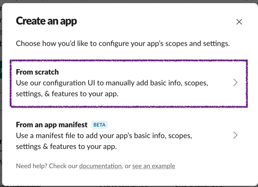
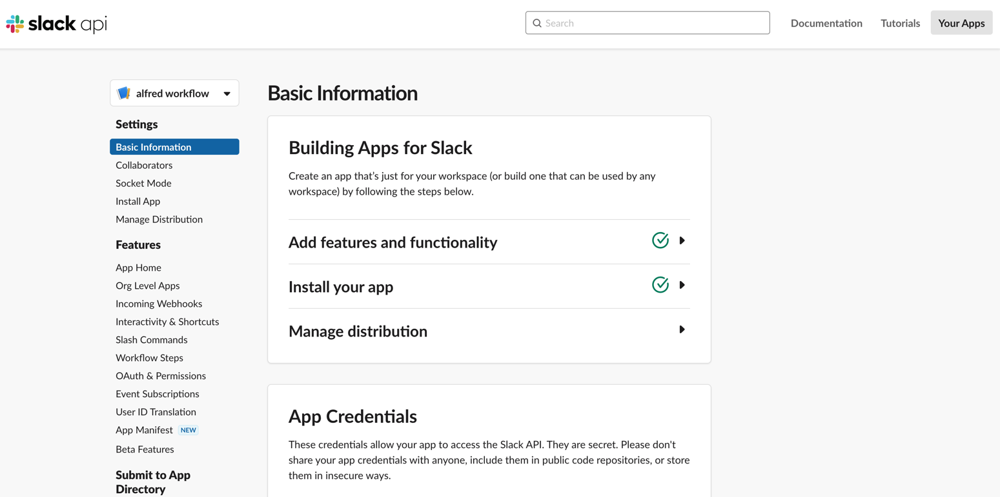
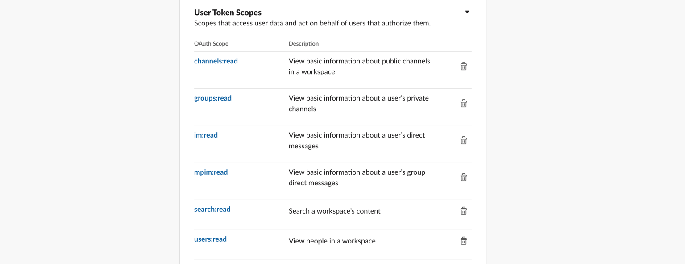
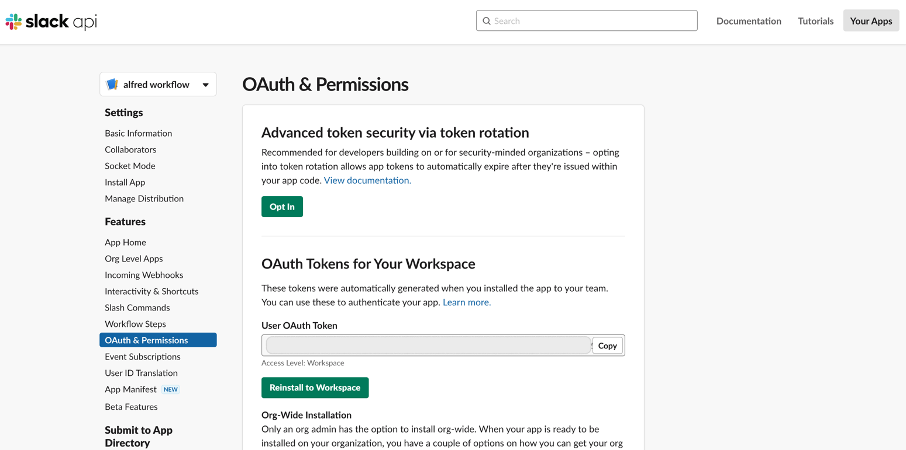
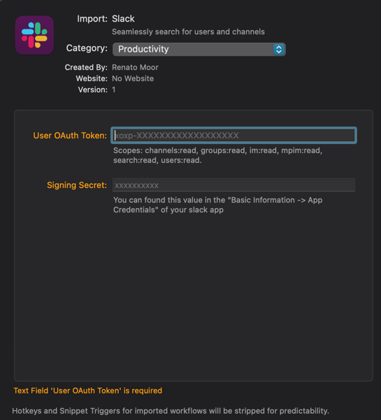
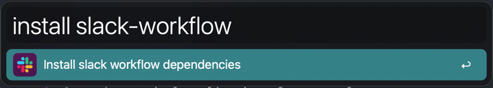

# Install the Slack App for the Alfred Workflow
This guide will walk you through the installation 
process for the Slack app required to retrieve user
and channel information for your Alfred workflow. 
Follow the steps below to get started.


## 1. Create an slack app
First thing’s first: you’ll want to [create a Slack app](https://api.slack.com/apps?new_app=1).


After you fill out an app name (you can change it later)
and pick a workspace to install it to, hit the `Create App` 
button, and you’ll land on your app’s Basic Information page.

This page contains an overview of your app in addition to important
credentials you’ll need later, like the `Signing Secret` under the App Credentials header.  



## 2. Tokens and installing app
We’re going to use bot and app tokens.

1. Navigate to the OAuth & Permissions on the left sidebar 
   and scroll down to the Bot Token Scopes section. Click Add an OAuth Scope.

2. Now we have to grant the permissions for the scopes
`channels:read`, `groups:read`, `im:read`, `mpim:read`, `search:read`, `users:read`.  



3. Scroll up to the top of the OAuth & Permissions page and click Install App to Workspace. 
You’ll be led through Slack’s OAuth UI, where you should allow your app to be installed to
your development workspace.

4. Once you authorize the installation, you’ll land on the OAuth & Permissions page and 
see a User OAuth Token.
  


Congratulations you have created the slack application

## 3. Installing the workflow

1. Download the [slack-workflow](https://github.com/renatomoor/slack-alfred-workflow/raw/main/docs/documents/slack-workflow.alfredworkflow)
2. Open the [slack-workflow](https://github.com/renatomoor/slack-alfred-workflow/raw/main/docs/documents/slack-workflow.alfredworkflow) file and install the workflow.
3. Add the env variables of the slack application   
Basic Information -> App Credentials -> `Signing Secret`
OAuth & Permissions -> OAuth Tokens for Your Workspace -> `User OAuth Token`
  

  
4. click the install button

## 4. Install Homebrew
[Homebrew](https://brew.sh/) is a requirement to install the dependencies of the slack workflow application

 1. Open the terminal application of your preference
 2. copy and paste this line
   ```shell
    /bin/bash -c "$(curl -fsSL https://raw.githubusercontent.com/Homebrew/install/HEAD/install.sh)"
   ```
 3. It is a Package Manager so for installing you would need to provide your computer password for this installations

## 5. Install Slack Workflow dependencies

::: warning
[Homebrew](https://brew.sh/) is required
:::

 1. Open alfred
 2. Type the command: `install slack-workflow`
  
 

## 6. Update slack users and channels

 1. Open alfred
 2. Type the command: `update slack-workflow`


Now you are ready to go.

<a href="https://www.buymeacoffee.com/renatomoor" target="_blank"></a>


## Usage

You can use now the workflow opening alfred and starting by `@` or `#`
  


